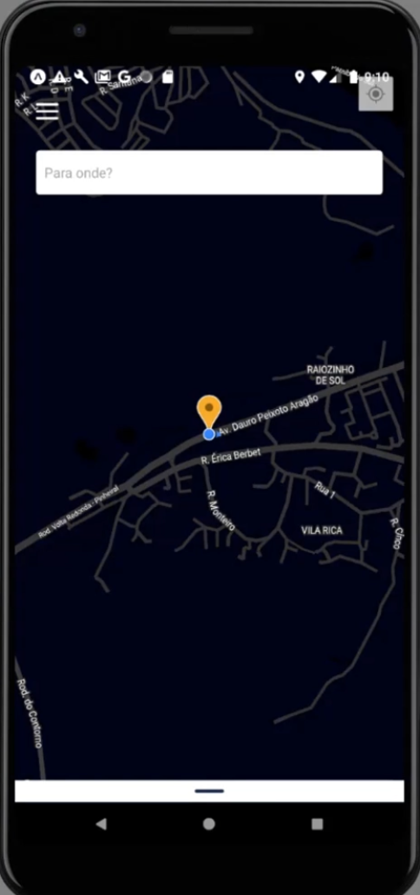
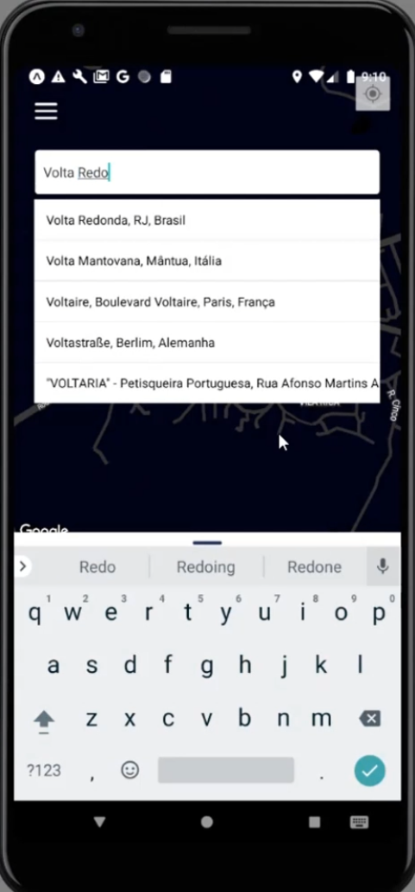

<h1 align="center">
    MakeYourGO
</h1>

  

  
  
  
    
   
  
  
  

## 💻 Sobre o projeto

MakeYourGO - é uma aplicação desenvolvida em React Native com Typescript e styled-components apresentado como trabalho de conclusão do curso de Sistemas de Informação. Trata-se de um sistema que realiza a comparação entre aplicativos de corrida privada como uber, 99, cabify, etc, exibindo os valores e o tempo de espera de cada um para uma viagem com origem e destino informados. Além disso, é possível realizar o pedido da corrida através dele. 

---

## ⚙️ Funcionalidades

- [x] Tela de Login e Cadastro.
- [x] Tela para recuperação de senha com envio de email.
- [x] Api criada para armazenamento de usuários.
- [x] Utilização da api do Google Maps para localização.
- [x] Autocomplete de Endereços.
- [x] Traçador de rota no mapa.
- [x] Cards exibindo os valores e tempo de espera de cada aplicativo.
- [x] Botão para solicitar corrida.
- [x] Menu lateral com informações do usuário e opção de signOut.  

---

## 🎨 Layout

    
    
    
    

---

## 🦸 Autor

  
 <b>Guilherme Veroneze</b></a> 🚀
  

---

## 📝 Licença

Este projeto está sob a licença [MIT](./LICENSE).

Feito com muita dedicação por Guilherme Veroneze 👋🏽 [Entre em contato!](https://github.com/Veronezegui)

---
